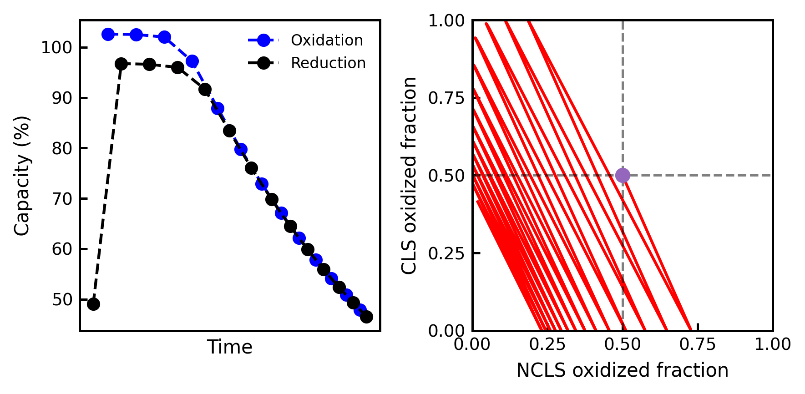

# Overview

`rfbzero.py` is a Python package for zero-dimensional simulation of electrochemical cycling of redox flow batteries. This package currently includes the following modules for initial cell setup and electrolyte description, cycling protocol selection, and optional inputs for various capacity degradation mechanisms and active species crossover:
 
- _redox flow cell setup_: easy configuration of flow cell and electrolyte parameters
- _cycling protocol_: quickly define the desired electrochemical cycling protocol
- _capacity fade mechanisms_: include optional electrolyte degradation mechanisms
- _crossover_: include optional crossover mechanisms inherent to the electrolytes and cell

# Background
Redox flow batteries (RFBs) are seen as a promising long-duration energy storage technology for grid-scale applications. Zero-dimensional models have previously been developed to understand the electrochemical cycling behaviour of vanadium-based electrolytes in RFBs [@2018_Konig_JPOWERSOURCE; @2018_Murthy_JES; @2018_Pugach_APPENERG; @2019_Lee_JECHEMENERGCONVSTOR], where the dominant capacity fade mechanism involves crossover of active species between negolyte (negative electrolyte) and posolyte (positive electrolyte) reservoirs. The development of next-generation electrolyte chemistries, such as redox-active organic molecules (RAOMs) [@2020_Kwabi_CHEMREV], in the past decade requires new models that incorporate properties inherent to novel chemistries. It is often the case that RAOMs are sufficiently bulky so as not to experience appreciable membrane crossover in an RFB, yet, unlike vanadium-ion-based electrolytes, they can experience chemical degradation leading to capacity decay. Recent work [@2021_Modak_JES; @2022_Neyhouse_JES] has extended VRFB-based zero-dimensional models to now include the effect of chemical degradation of redox-active organics in RFBs. At each time step iteration in zero-dimensional models, the concentrations of reduced and oxidized redox-actives are updated via Coulomb counting and the open-circuit voltage (OCV) of the cell is then calculated from the Nernst equation. Species concentrations and cell current are then used to determine the ohmic, activation, and mass transport overpotentials. Summing OCV and overpotentials yields the cell voltage. The cell current for the next time step is then determined by the cell voltage, via the cycling protocol. The inclusion of degradation mechanisms in the zero-dimensional RFB model has already contributed to the understanding of self-discharge mechanisms in aqueous RFBs [@2023_Fell_JES].

# Statement of need
To date, zero-dimensional RFB models have typically been disseminated in the literature via ad hoc non-generalizable equations/code and often written in proprietary programming languages. With `rfbzero.py` we provide an open-source Python package that proliferates electrochemical engineering learning objectives for RFBs, as well as allows for the expansion of battery diagnostics via understanding of capacity fade mechanisms observed in the RAOM flow battery community.

# Current `rfbzero.py` functionality

## Cell design
The initial flow cell design can be configured via the `redox_flow_cell.py` module. Examples of adjustable, RFB-specific, parameters include electrode active and geometric area, cell ohmic resistance, starting concentrations of redox-active species (oxidized and/or reduced), and reservoir volumes of the capacity limiting side (CLS) and non-capacity limiting side (NCLS) electrolytes. The user can also declare the electrolyte configuration of the RFB: a **Symmetric Cell** with identical redox-actives in both reservoirs and a 0 V OCV when both reservoirs are at 50% state-of-charge (SOC), or a **Full Cell** with different redox-actives in each reservoir and an OCV > 0 V.

## Cycling protocol
Cells can be electrochemically cycled by constant current (CC), constant current followed by constant voltage (CCCV), or constant voltage (CV). CC and CCCV cycling require user input of applied currents, while CCCV and CV cycling require input of current cutoffs for charge and discharge. All techniques require input of voltage limits for charge and discharge. If the desired applied current during CCCV cycling is higher than what the cell can provide, CV cycling takes place.

## Degradation mechanisms
Optional capacity fade mechanisms can also be incorporated. These include chemical degradation, chemical redox of active species (e.g. self-discharge), or multiple stacked degradation mechanisms. Rate constants and reaction rate orders can be adapted as needed to the electrolyte chemistries in each reservoir.

## Crossover mechanisms
Crossover of redox-active species through the ion-exchange membrane, driven by concentration gradients, can also be included in simulations. Permeabilities of oxidized and reduced species, and membrane thickness, can be set by the user.

## Simulation outputs
Multiple model outputs can be accessed from the simulation results including: temporal profiles for voltage, current, capacity, SOC, and overpotentials. Half-cycle capacities and duration of cycles can also be accessed.

# An Example of the `rfbzero.py` API
The documentation for `rfbzero.py` includes a getting started guide(insert link) and examples of RFB cells cycled under different protocols. An example for CC cycling at 100 mA for a symmetric cell with OCV = 0.0 V, charging voltage = 0.2 V, discharging voltage = -0.2 V, and cycled for 500 seconds, is shown below:

```python
from redox_flow_cell import ZeroDModel
from experiment import ConstantCurrent


# 1. define symmetric cell and electrolyte parameters
cell = ZeroDModel(
    cls_volume=0.005,       # liters
    ncls_volume=0.050,      # liters
    cls_start_c_ox=0.01,    # molar
    cls_start_c_red=0.01,   # molar
    ncls_start_c_ox=0.01,   # molar
    ncls_start_c_red=0.01,  # molar
    init_ocv=0.0,           # volts
    resistance=0.5,         # ohms
    k_0_cls=1e-3,           # cm/s
    k_0_ncls=1e-3,          # cm/s
)

# 2. define cycling protocol
protocol = ConstantCurrent(
    voltage_limit_charge=0.2,      # volts
    voltage_limit_discharge=-0.2,  # volts
    current=0.1,                   # amps
)

# 3. simulate the cell, via protocol, for 500 seconds
results = protocol.run(cell_model=cell, duration=500)
```


A second example of a symmetric cell with CCCV cycling (&plusmn;50 mA, &plusmn;0.2 V, &plusmn;5 mA cutoffs), an auto-reduction degradation mechanism, and cycled for 4000 seconds, is shown below:

```python
from redox_flow_cell import ZeroDModel
from experiment import ConstantCurrentConstantVoltage
from degradation import AutoReduction


# 1. define symmetric cell and electrolyte parameters
cell = ZeroDModel(
    cls_volume=0.005,       # liters
    ncls_volume=0.010,      # liters
    cls_start_c_ox=0.01,    # molar
    cls_start_c_red=0.01,   # molar
    ncls_start_c_ox=0.01,   # molar
    ncls_start_c_red=0.01,  # molar
    init_ocv=0.0,           # volts
    resistance=0.5,         # ohms
    k_0_cls=1e-3,           # cm/s
    k_0_ncls=1e-3,          # cm/s
)

# 2. define cycling protocol
protocol = ConstantCurrentConstantVoltage(
    voltage_limit_charge=0.2,         # volts
    voltage_limit_discharge=-0.2,     # volts
    current_cutoff_charge=0.005,      # amps
    current_cutoff_discharge=-0.005,  # amps
    current=0.05,                     # amps
)

# 3. define chemical degradation
deg = AutoReduction(rate_constant=3e-4)

# 4. simulate the cell with degradation, via protocol, for 4000 seconds
results = protocol.run(
    cell_model=cell,
    degradation=deg,
    duration=4000)
```




# Acknowledgements
We thank Prof. David Kwabi, Thomas George, and Jordan Sosa for constructive feedback and testing.

# References


